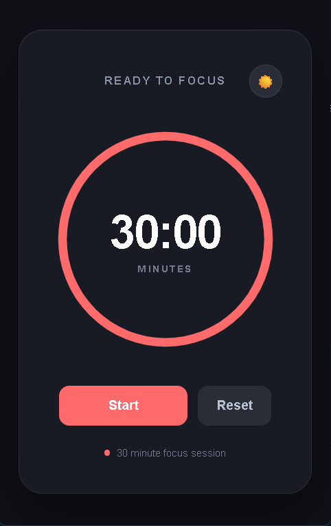
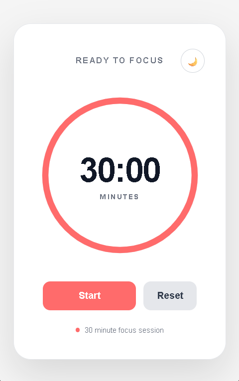

# 🍅 Pomodoro Timer

A clean and minimalist **Pomodoro Timer desktop application** built with **React** and **Electron**.

The app provides a focused 30-minute work session with a circular progress indicator, timer controls, dark/light mode, and a confetti animation when the session is completed.

## ✨ Features

- ⏱️ 30-minute focus timer
- ▶️ Start / Pause functionality
- 🔄 Reset the current session
- 🎉 Confetti animation when the timer reaches zero
- 🌓 Dark and Light mode
- 🔵 Circular SVG progress indicator
- 💻 Desktop application powered by Electron
- 📐 Responsive and centered UI
- 🧹 Minimal and distraction-free interface

## 🛠️ Tech Stack

- React
- Electron
- JavaScript
- CSS
- SVG
- canvas-confetti

## 📸 Preview

  
  

  
    <strong>Dark Mode</strong>
  
  
    <strong>Light Mode</strong>
  

## 🚀 Getting Started

### Prerequisites

Make sure you have the following installed:

- [Node.js](https://nodejs.org/)
- npm
- Git

### Clone the Repository

    git clone https://github.com/TanayUmre/pomodoro-timer.git

Navigate into the project:

    cd pomodoro-timer

### Install Dependencies

    npm install

### Run the Application

Start the React development environment and Electron application with:

    npm run electron:dev

This command starts the development environment and automatically opens the Pomodoro Timer as an Electron desktop application.

## 📁 Project Structure

    pomodoro-timer/
    │
    ├── electron/
    │   └── main.js
    │
    ├── src/
    │   ├── Pomodoro.jsx
    │   ├── main.css
    │   └── ...
    │
    ├── package.json
    ├── package-lock.json
    └── README.md

The exact structure may vary depending on your React/Vite setup.

## ⚙️ How It Works

The timer starts with a 30-minute duration.

    const TOTAL_TIME = 30 * 60;

React state manages the remaining time and timer status.

    const [timeLeft, setTimeLeft] = useState(TOTAL_TIME);
    const [isRunning, setIsRunning] = useState(false);

When the timer is running, `useEffect` creates an interval that decreases the remaining time every second.

The circular progress indicator is calculated using the circumference of the SVG circle.

    const circumference = 2 * Math.PI * 120;
    const progress = timeLeft / TOTAL_TIME;
    const dashOffset = circumference * (1 - progress);

When the timer reaches zero, the application triggers a confetti animation.

    confetti({
      particleCount: 150,
      spread: 100,
      origin: { y: 0.6 },
    });

## 🎨 Dark & Light Mode

The application supports both dark and light themes.

The current theme is managed using React state.

    const [isDark, setIsDark] = useState(true);

The theme is applied dynamically.

    

CSS then applies the appropriate colors and styling for each theme.

## 🖥️ Electron

Electron is used to run the React application as a desktop application.

The Electron main process creates the application window with configurable dimensions and minimum sizes.

    mainWindow = new BrowserWindow({
      width: 500,
      height: 650,
      minWidth: 400,
      minHeight: 550,

      alwaysOnTop: true,
      frame: true,
      autoHideMenuBar: true,

      webPreferences: {
        nodeIntegration: false,
        contextIsolation: true,
      },
    });

The `alwaysOnTop` option allows the Pomodoro timer to remain visible while working in other applications.

## 🔮 Future Improvements

- 🍅 Custom focus durations
- ☕ Short and long break sessions
- 🔔 Desktop notifications
- 🔊 Optional completion sounds
- 📊 Daily and weekly productivity statistics
- 💾 Persistent user settings
- ⌨️ Keyboard shortcuts
- 📌 System tray support
- 🎯 Multiple Pomodoro sessions
- ⚙️ Settings panel
- 📦 Production builds for Windows, macOS, and Linux
